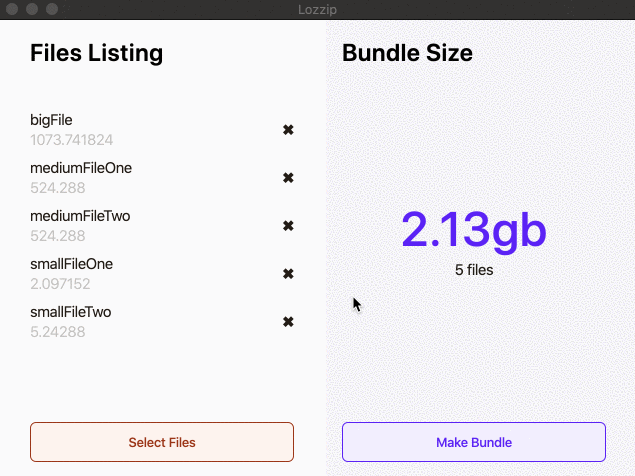

# Lozzip
> A minimalistic zip bundler alternative for MacOS.



## Installation

OS X:

[Click here to download.](https://github.com/afonsolopez/Lozzip/raw/master/out/make/zip/darwin/x64/Lozzip-darwin-x64-1.0.0.zip)

## Development setup

This project was developed on [Electron framework](https://www.electronjs.org/)

```sh
npm install
npm run start
```

## Release History

* 1.0.0
    * Base stable version (MVP)

## Meta

Afonso Lopez – [Afonso's personal website/blog](https://afonsolopez.com/)

Distributed under the GNU General Public License v2.0 license.

## Contributing

Feel free to fork it and improve it as you want.
